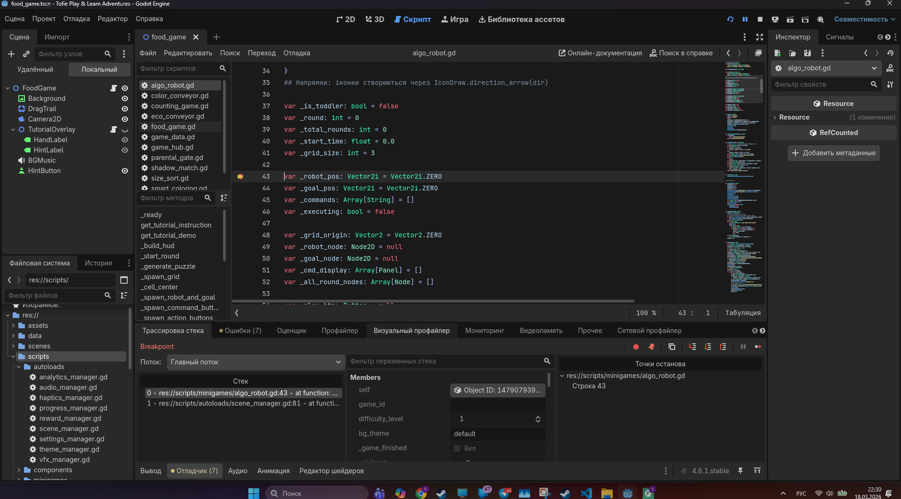

# Feed the Animals — Kids Game

Educational children's matching game built with Godot 4.6.1. Players match animals with their correct food by dragging and dropping (or using keyboard controls).

## How to Play

- **Mouse/Touch**: Drag a food item onto the correct animal
- **Keyboard**: Arrow keys to select (Left/Right = food, Up/Down = animal), Enter/Space to confirm

Correct match removes both and adds a new animal. Match all 19 animals to win.

## Animal-Food Pairs (19 unique 1:1 pairings)

| Animal | Food |
|--------|------|
| Bunny | Carrot |
| Dog | Bone |
| Bear | Honey |
| Monkey | Banana |
| Cat | Fish |
| Chicken | Wheat |
| Cow | Grass |
| Crocodile | Drumstick |
| Frog | Mosquito |
| Deer | Leaf |
| Elephant | Watermelon |
| Horse | Hay |
| Lion | Meat |
| Penguin | Shrimp |
| Panda | Bamboo |
| Goat | Cabbage |
| Mouse | Cheese |
| Squirrel | Walnut |
| Hedgehog | Apple |

## How to Run

1. Install [Godot 4.6.1](https://godotengine.org/download)
2. Open the `game/project.godot` file in Godot Editor
3. Press F5 (or the Play button)

## Run Tests

```bash
godot --headless --path game/ -s tests/run_all_tests.gd
```

## Project Structure

```
ProjectKOS/
├── game/                        # Godot project root
│   ├── project.godot            # Engine config
│   ├── scenes/
│   │   ├── main/food_game.tscn  # Main game scene
│   │   ├── ui/                  # UI screens (menus, shop, settings)
│   │   ├── animals/             # Animal Sprite2D scenes (19)
│   │   └── food/                # Food Sprite2D scenes (19)
│   ├── scripts/
│   │   ├── food_game.gd         # Scene orchestrator
│   │   ├── game_data.gd         # Animal-food pairs + constants
│   │   ├── round_manager.gd     # Round logic + spawning
│   │   ├── drag_controller.gd   # Input handling (mouse + keyboard)
│   │   └── autoloads/           # 5 autoloads (Theme, Scene, Settings, Analytics, Audio)
│   ├── tests/                   # Headless test suite (17 tests)
│   └── assets/
│       ├── sprites/animals/     # Animal PNG sprites (512x512)
│       ├── sprites/food/        # Food PNG sprites (512x512)
│       ├── backgrounds/         # Background images
│       ├── icons/               # App icons (512 + 1024)
│       ├── audio/               # SFX + BGM
│       └── translations/        # 4-language CSV (en, uk, fr, es)
├── scripts/tools/               # Python asset generators
├── ARCHITECTURE.md              # Coding standards & architecture
├── STORE_LISTING.md             # App Store & Google Play metadata
├── SCREENSHOT_GUIDE.md          # Screenshot requirements for stores
├── .github/workflows/test.yml   # CI pipeline
└── README.md
```

## Store Links

- **Google Play**: Coming soon
- **Apple App Store**: Coming soon

## Adding a New Animal

1. Add the animal sprite PNG to `game/assets/sprites/animals/`
2. Add the food sprite PNG to `game/assets/sprites/food/`
3. Create a `.tscn` scene for the animal in `game/scenes/animals/` (Sprite2D with texture)
4. Create a `.tscn` scene for the food in `game/scenes/food/` (Sprite2D with texture)
5. Add a new entry to `GameData.ANIMALS_AND_FOOD` in `game/scripts/game_data.gd`
